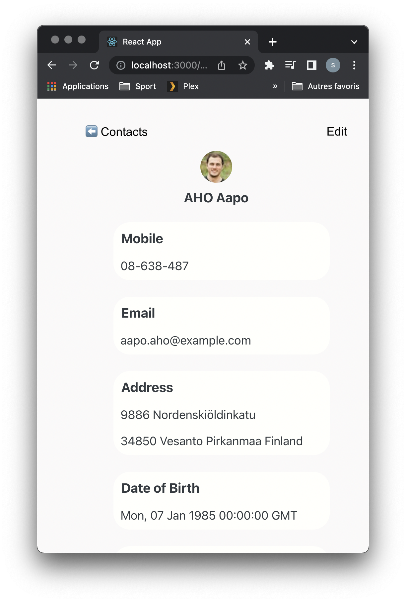

# Contact-app

### --- Préambule et changements à effectuer ---

Bonjour !  
Alors, afin que l'appli fonctionne on a dû effectuer quelques changements au niveau du proxy et des fetchs des fichiers ContactList.js et ContactInfos.js.
Si jamais cela ne fonctionne donc pas chez vous, il faut :
- Dans le fichier *"package.json"* -> changer le proxy par "http://localhost:8080"
- Dans le fichier *"ContactList.js"* -> changer l'adresse dans le fetch par seulement "/contacts"
- Dans le fichier *"ContactInfo.js"* -> changer l'adresse dans le fetch par seulement "/contacts"

### --- Interface ---
  

